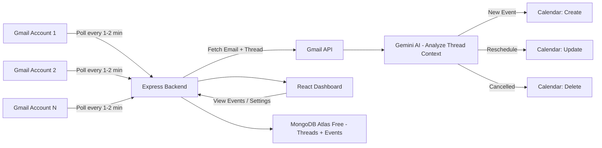
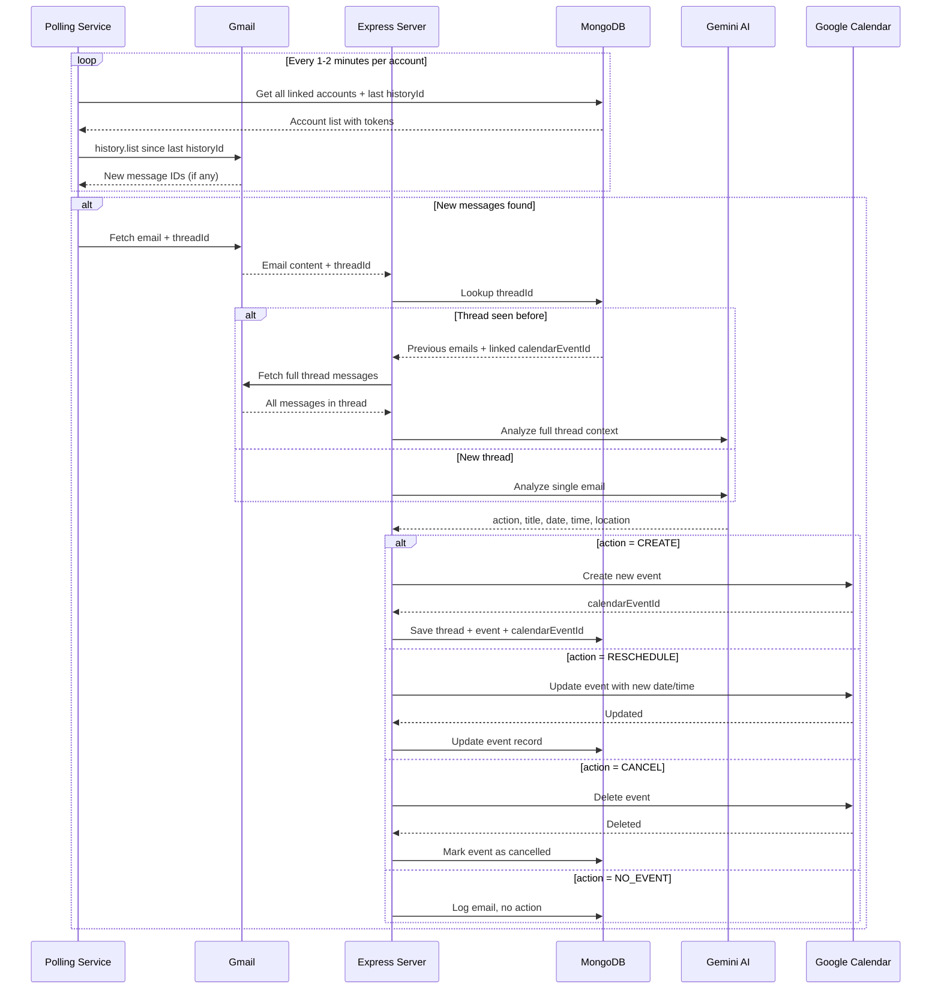

# Email Notification → Google Calendar Automation

## Architecture Overview



## Tech Stack (100% Free Tier)

| Layer | Technology | Free Tier |
|-------|-----------|-----------|
| **Backend** | Node.js + Express | Free (local) |
| **Frontend** | React.js (Vite) | Free (local) |
| **Email Detection** | Gmail API + Polling (every 1-2 min) | Free — 1B quota units/day |
| **Event Extraction** | Google Gemini API (AI-powered NLP) | Free — 15 RPM, 1M tokens/min |
| **Calendar** | Google Calendar API | Free — 1M queries/day |
| **Database** | MongoDB Atlas (free cluster) | Free — 512 MB storage |
| **Auth** | Google OAuth 2.0 | Free |

> **No Pub/Sub needed.** We use Gmail API's `history.list` to poll for new
> messages. This is simpler, fully free, and doesn't require a billing account.
> The polling interval (1-2 min) is fast enough for calendar events.

## Project Structure

```
Email-Notification automation/
├── backend/
│   ├── src/
│   │   ├── config/          # Environment & Google OAuth config
│   │   ├── controllers/     # Route handlers
│   │   ├── services/        # Gmail, Calendar, Gemini, Poller services
│   │   ├── models/          # Mongoose models
│   │   ├── routes/          # Express routes
│   │   ├── middleware/       # Auth middleware
│   │   └── app.js           # Express app entry
│   ├── package.json
│   └── .env.example
├── frontend/
│   ├── src/
│   │   ├── components/      # React components
│   │   ├── pages/           # Dashboard, Settings, Login
│   │   ├── services/        # API client
│   │   ├── context/         # Auth context
│   │   └── App.jsx
│   ├── package.json
│   └── vite.config.js
└── README.md
```

## Key Features

1. **Google OAuth Login** — Sign in with Google, grant Gmail + Calendar permissions
2. **Multi-Account Support** — Link multiple Gmail accounts, monitor all of them
3. **Near Real-time Email Monitoring** — Polls Gmail API every 1-2 min for new messages
4. **AI Event Extraction** — Gemini parses email body for dates, times, locations, titles
5. **Thread-Aware Processing** — Tracks Gmail threads; understands replies in context
6. **Auto Calendar Entry** — Detected events are automatically added to Google Calendar
7. **Smart Rescheduling** — If a reply says "let's move to 3pm Tuesday", the existing event is updated
8. **Cancellation Detection** — If a reply says "meeting cancelled", the calendar event is deleted
9. **Dashboard** — View processed emails, detected events, calendar entries, and logs
10. **Settings** — Toggle auto-add, configure which labels/senders to monitor

## API Endpoints

| Method | Endpoint | Description |
|--------|----------|-------------|
| GET | `/api/auth/google` | Initiate Google OAuth |
| GET | `/api/auth/google/callback` | OAuth callback |
| GET | `/api/auth/me` | Get current user |
| POST | `/api/auth/logout` | Logout |
| GET | `/api/accounts` | List all linked Gmail accounts |
| POST | `/api/accounts/link` | Link a new Gmail account (triggers OAuth) |
| DELETE | `/api/accounts/:accountId` | Unlink a Gmail account |
| GET | `/api/emails` | List processed emails (across all accounts) |
| GET | `/api/threads/:threadId` | Get full thread history and linked events |
| GET | `/api/events` | List detected events |
| POST | `/api/events/:id/add-to-calendar` | Manually add event to calendar |
| PUT | `/api/events/:id` | Manually update/reschedule an event |
| DELETE | `/api/events/:id` | Cancel and remove a calendar event |
| GET | `/api/settings` | Get user settings |
| PUT | `/api/settings` | Update user settings |

## Flow: Thread-Aware Email → Calendar Event



## Database Models

### User
```js
{
  email:          String,       // primary login email
  name:           String,
  accounts:       [ObjectId],   // ref -> GmailAccount (multiple)
  settings: {
    autoAdd:       Boolean,     // auto-add events or require approval
    monitorLabels: [String],    // e.g. ["INBOX", "CATEGORY_PERSONAL"]
    filterSenders: [String],    // whitelist specific senders (optional)
  },
  createdAt:      Date
}
```

### GmailAccount
```js
{
  userId:          ObjectId,    // ref -> User
  googleId:        String,      // Google account ID
  email:           String,      // linked Gmail address
  accessToken:     String,      // OAuth access token (encrypted)
  refreshToken:    String,      // OAuth refresh token (encrypted)
  lastHistoryId:   String,      // Gmail history ID for polling
  isActive:        Boolean,     // enable/disable monitoring
  linkedAt:        Date,
  lastPolledAt:    Date
}
```

### ProcessedThread
```js
{
  userId:            ObjectId,   // ref -> User
  accountId:         ObjectId,   // ref -> GmailAccount
  gmailThreadId:     String,     // Gmail thread ID (unique per account)
  lastMessageId:     String,     // last processed message ID in this thread
  messageCount:      Number,     // how many messages processed so far
  linkedEvent:       ObjectId,   // ref -> Event (if an event was created)
  status:            String,     // "active" | "cancelled" | "no_event"
  threadSnippet:     String,     // preview text
  firstProcessedAt:  Date,
  lastProcessedAt:   Date
}
```

### Event
```js
{
  userId:            ObjectId,   // ref -> User
  threadId:          ObjectId,   // ref -> ProcessedThread
  calendarEventId:   String,     // Google Calendar event ID
  title:             String,
  description:       String,
  location:          String,
  startTime:         Date,
  endTime:           Date,
  status:            String,     // "scheduled" | "rescheduled" | "cancelled"
  history: [{                    // track changes over time
    action:          String,     // "created" | "rescheduled" | "cancelled"
    previousStart:   Date,
    previousEnd:     Date,
    changedAt:       Date,
    triggerEmailId:  String      // which email caused this change
  }],
  createdAt:         Date,
  updatedAt:         Date
}
```

## Gemini AI Prompt Design

When analyzing an email (or thread), we send Gemini a structured prompt like:

```
You are an email event extraction assistant. Analyze the following email
thread and determine if it contains, modifies, or cancels a calendar event.

Respond with JSON only:
{
  "action": "CREATE" | "RESCHEDULE" | "CANCEL" | "NO_EVENT",
  "confidence": 0.0 - 1.0,
  "event": {
    "title": "...",
    "date": "YYYY-MM-DD",
    "startTime": "HH:MM",
    "endTime": "HH:MM",
    "location": "...",
    "description": "..."
  },
  "reasoning": "Brief explanation of why this action was chosen"
}

--- EXISTING EVENT (if any) ---
{previousEventDetails}

--- EMAIL THREAD ---
{threadMessages}
```

> By feeding the existing event details + full thread, Gemini can detect
> rescheduling ("let's move to 3pm") and cancellations ("meeting is off").

## Setup Requirements (All Free)

> **Prerequisites — you will need these before running the app:**
>
> 1. **Google Cloud Project** with these APIs enabled (all free):
>    - Gmail API (free — 1 billion quota units/day)
>    - Google Calendar API (free — 1 million queries/day)
> 2. **OAuth 2.0 Client ID** (Web application type) — free
> 3. **Gemini API Key** from Google AI Studio — free tier (15 RPM)
> 4. **MongoDB Atlas** free cluster (512 MB) — [atlas.mongodb.com](https://atlas.mongodb.com)
>
> **No billing account required. No Pub/Sub needed.**

## Open Questions

- [ ] Any specific email labels or senders to filter (e.g., only Primary inbox)?
- [ ] Do you want in-app notifications when an event is created/rescheduled/cancelled?
- [ ] Minimum confidence threshold for Gemini — auto-add at 0.8+, require approval below?
- [x] Which Gmail account's calendar should events go to? → **Primary account's calendar** (the account used to log in)

