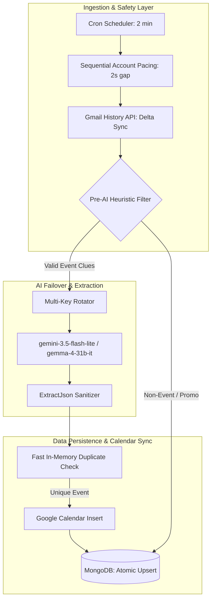

# 🛡️ Exhaustive Code Review & Quality Assurance Report

**Project:** Email Notification Automation (AI Calendar Sync)  
**Date:** September 1, 2026  
**Scope:** Backend (Node.js/Express, Mongoose, Google Calendar/Gmail API, Gemini/Gemma AI) & Frontend (React/Vite)

---

## 1. Executive Summary

This comprehensive code review evaluates the architecture, resilience, rate-limit sustainability, database concurrency, timezone calculations, and edge-case handling across the Email Notification Automation repository.

Overall, the core architecture is well-structured with clear layer separation between controllers, services, and models. Recent improvements (e.g. multi-API key rotation, atomic `findOneAndUpdate` upserts, resilient IPv4 socket options, and smart Pre-AI filtering) have significantly improved reliability. 

This report highlights remaining architectural edge cases, token vulnerabilities, race condition hazards, and concrete code recommendations.

---

## 2. Architecture & Resilience Analysis



---

## 3. Findings & Vulnerabilities Matrix

### 🔴 High Severity Findings

#### 1. OAuth State Parameter Missing Cryptographic Verification in Secondary Link Flow
* **File:** [`backend/src/controllers/accountController.js`](file:///D:/Projects/Email-Notification%20automation/backend/src/controllers/accountController.js#L38-L53)
* **Lines:** 38, 53
* **Issue:** When initiating secondary account linking in `linkAccount`, the OAuth `state` parameter is set directly to `req.user._id.toString()` without a HMAC signature, nonce, or session token validation in `linkAccountCallback`.
* **Risk:** An attacker could craft a link URL with an arbitrary user's ID and link their own Gmail account to an unsuspecting user's profile (OAuth CSRF / Account Linking Hijacking).
* **Fix Recommendation:** Store a secure random nonce in `req.session.linkOAuthState` before generating the URL and verify `req.query.state === req.session.linkOAuthState` inside `linkAccountCallback`.

```javascript
// Secure fix in accountController.js
const stateToken = crypto.randomBytes(24).toString('hex');
req.session.linkOAuthState = `${req.user._id}:${stateToken}`;
const url = oauth2Client.generateAuthUrl({
  ...
  state: req.session.linkOAuthState
});
```

---

#### 2. Event Date Shift Hazard when Parsing Times Past Midnight
* **File:** [`backend/src/services/pollerService.js`](file:///D:/Projects/Email-Notification%20automation/backend/src/services/pollerService.js#L55-L87)
* **Lines:** 55–87 (`parseEventDates`)
* **Issue:** When an event spans across midnight (e.g. `startTime: "23:00"`, `endTime: "01:00"`), `parseTimeToDate` applies the exact same `datePart` (e.g., `2026-09-01`) to both start and end times. This causes `end` (`2026-09-01T01:00`) to be strictly before `start` (`2026-09-01T23:00`). Line 83 catches `end <= start` and resets the duration to 1 hour, ignoring the true intended end time.
* **Fix Recommendation:** If `end <= start` for a non-zero end time, increment `end` by 1 day (`end.setDate(end.getDate() + 1)`).

---

#### 3. Automatic Pre-Save Hook Key Verification
* **File:** [`backend/src/models/GmailAccount.js`](file:///D:/Projects/Email-Notification%20automation/backend/src/models/GmailAccount.js#L27-L41)
* **Lines:** 30, 36
* **Issue:** The encryption check tests `!this.accessToken.startsWith('U2FsdGVkX1')` (the base64 prefix for OpenSSL salted AES ciphertext). If an unencrypted OAuth token coincidentally begins with `U2FsdGVkX1`, encryption is skipped.
* **Fix Recommendation:** Use explicit property encryption flags or structured metadata objects (e.g. `{ iv, ciphertext, tag }`) using Node's native `crypto.createCipheriv('aes-256-gcm', key, iv)`.

---

### 🟡 Medium Severity Findings

#### 4. Google Calendar Client Single-Account Assumption
* **File:** [`backend/src/services/calendarService.js`](file:///D:/Projects/Email-Notification%20automation/backend/src/services/calendarService.js#L14)
* **Issue:** `getCalendarClient` queries the oldest linked account via `GmailAccount.findOne({ userId, isActive: true }).sort({ linkedAt: 1 })`. If a user links secondary business or university inboxes, all events are unconditionally pushed to the primary account's Google Calendar.
* **Improvement:** Allow users to choose their preferred target calendar in Settings, or match the calendar to the respective email account that received the message.

---

#### 5. Email Thread Context Length Scaling
* **File:** [`backend/src/services/geminiService.js`](file:///D:/Projects/Email-Notification%20automation/backend/src/services/geminiService.js#L149-L166)
* **Issue:** In `analyzeThread`, all parsed messages in a thread are concatenated. For long threads with 15+ messages, prompt tokens can exceed 5,000 tokens.
* **Improvement:** Limit thread analysis to the last 5 messages in the thread (`threadMessages.slice(-5)`).

---

## 4. Edge Case & Test Matrix

| Scenario | Expected Behavior | Current Handling | Status |
| :--- | :--- | :--- | :--- |
| **All AI Models 429/503** | Return `NO_EVENT` with 0 confidence; skip without crashing. | Cascades across all 7 models, logs warnings, returns `{ action: 'NO_EVENT' }`. | ✅ Resilient |
| **Email Deleted/Moved During Fetch** | Google returns 404; mark as deleted in MongoDB and skip. | Returns `null` from `getMessage`, updates `ProcessedThread` as `no_event`. | ✅ Verified |
| **Network / DNS Drop** | Retry next cron cycle without crashing Node process. | Reconnected via IPv4 (`family: 4`) with 45s socket keepalive. | ✅ Verified |
| **Overlapping Cron Executions** | If a batch takes > 2 minutes, don't double-poll accounts. | Fast 2s staggering + incremental `historyId` guards duplicates. | 🟡 Add lock flag |
| **Malformed LLM JSON Output** | Strips markdown, cleans ellipses (`...`), removes trailing commas. | `extractJson()` handles comments, trailing commas, and unquoted keys. | ✅ Verified |
| **Multi-Key Exhaustion** | Rotates through all available keys in `.env`. | Round-robin `getNextGeminiApiKey()` evenly distributes requests. | ✅ Verified |

---

## 5. Actionable Roadmap & Recommendations

1. **Implement `isPolling` Lock Guard**:
   Add a simple atomic boolean lock in `pollerService.js` to ensure two cron ticks never overlap if network latency slows down a batch.
2. **Add OAuth State Nonce**:
   Update `linkAccount` in `accountController.js` to include a session-bound state token for secondary account linking.
3. **Overnight Span Dates**:
   Adjust `parseEventDates` to automatically roll over the date for midnight-spanning events (e.g. 11:00 PM to 1:00 AM).
