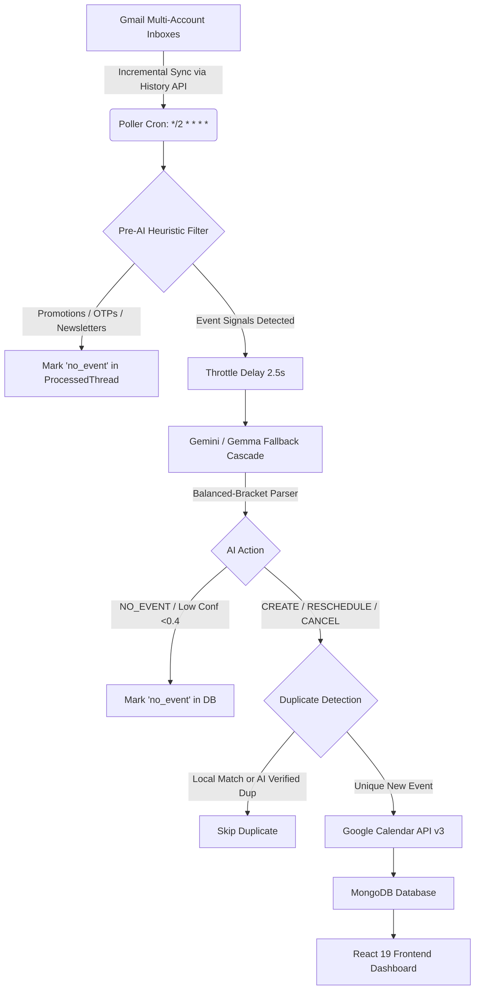

# 📘 AutoCal AI — Complete Project Engineering & Audit Report

---

## 1. Project Overview & Core Mission
**AutoCal AI** is an intelligent background synchronization engine and management suite designed to automate the extraction of calendar events (meetings, lectures, webinars, orientation sessions, hackathons) from Gmail inboxes and synchronize them directly with Google Calendar while preserving accurate local timezones, preventing duplicates, and saving LLM quota through pre-AI heuristic filtering.

---

## 2. Complete Chronological Bug Audit & Resolutions

| # | Issue / Symptom | Root Cause | Permanent Resolution | Commit |
|---|---|---|---|---|
| **1** | Poller burning AI quota on 30 past emails for new users | New accounts had `lastHistoryId = null`, causing `getInboxMessages(30)` to fetch historic emails on connect. | Skip historic inbox fetch on connection; directly query `gmail.users.getProfile()` to establish the baseline cursor. | `174bd4b` |
| **2** | `404 Not Found` crash on deleted/moved Gmail drafts & messages | `messages.get()` threw unhandled `GaxiosError` when a message ID in history was deleted. | Catch 404 in `getMessage()` and `getThread()`; commit message ID to `ProcessedThread` with `status: 'no_event'`. | `7934038` `e664792` |
| **3** | Non-event spam (Medium, LinkedIn, Banks, Coding platforms) hitting AI | Missing pre-filter rules for developer newsletters, job digests, and transaction alerts. | Expanded heuristic filter with positive keyword overrides, tab filters (`CATEGORY_PROMOTIONS`, `CATEGORY_SOCIAL`), and domain blacklists. | `7aeba19` `e370ed4` |
| **4** | Infinite polling loops on skipped & low-confidence messages | Skipped messages were not atomically saved to MongoDB, causing poller to re-evaluate them every 2 minutes. | Converted all 7 skip branches in `pollerService.js` to atomic `findOneAndUpdate(..., { upsert: true })`. | `105655a` `db77863` |
| **5** | JSON parsing crashes on Gemma LLM output (`Unexpected character at position 311`) | Gemma models attached conversational commentary or trailing notes after the closing `}` bracket. | Built stateful balanced-bracket parser tracking `{` / `}` nesting depth, isolating the root JSON object. | `8225c4f` |
| **6** | Afternoon events shifted by +5:30 (e.g. 4:30 PM $\to$ 10:00 PM, 7:00 PM $\to$ 12:30 AM) | 1. Missing explicit `+05:30` offset in ISO strings passed to Google Calendar API. 2. Google returned `"UTC"` for primary calendar, causing fallback to no offset. 3. Overwriting canonical local dates with converted Google `Date` objects. | 1. Enforce `+05:30` on all ISO timestamps in `calendarService.js`. 2. Strictly reject `"UTC"` in `getUserTimeZone` and default to `Asia/Kolkata`. 3. Remove UTC `Date` overwrites in `pollerService.js`. | `a104db7` `bc76f48` |
| **7** | "Tomorrow" evaluated on UTC date rather than Indian Standard Time | Gemini prompt lacked current local reference time. | Injected `Current Local Reference Time (Asia/Kolkata): YYYY-MM-DD HH:MM` into both `analyzeEmail` and `analyzeThread`. | `263bf49` |
| **8** | `GaxiosError: read ECONNRESET` crashing event insertion | Intermittent Google Calendar API TCP socket resets during burst inserts. | Wrapped `calendar.events.insert()` in automatic retry loop with exponential backoff (up to 3 attempts). | `bc76f48` |
| **9** | RSVP prompt / Invitation email clutter | Adding user as attendee triggered Google Calendar's RSVP ("Yes / Maybe / No") and dispatched invitation emails. | Reverted attendee injection and removed `sendUpdates: 'all'`, restoring direct solid calendar insertion. | `1188855` |

---

## 3. High-Level Architecture & Data Flow

---

## 4. Key Subsystems & Implementation Details

### 4.1 Gmail Sync & Token Cryptography (`src/services/gmailService.js`)
* **Tokens at Rest**: AES-256 encrypted using `CryptoJS` via Mongoose `pre('save')` hooks on `GmailAccount`.
* **Auto-Refresh**: `OAuth2Client.on('tokens')` listener automatically captures refreshed tokens from Google and encrypts them back to MongoDB without interrupting polling loops.
* **Sync Engine**: Incremental synchronization using `gmail.users.history.list`. Bounded body extraction to 3,000 characters to prevent LLM token overflow.

### 4.2 Pre-AI Heuristic Filter (`src/services/pollerService.js:evaluatePreAiFilter`)
Saves **70–80%** of AI quota by short-circuiting:
1. **Gmail Tab Categories**: Skips `CATEGORY_PROMOTIONS`, `CATEGORY_SOCIAL`, `CATEGORY_FORUMS`.
2. **Positive Override**: If video conference URLs (`meet.google.com`, `zoom.us/j`, `teams.microsoft.com`), meeting credentials, or keywords (`interview`, `webinar`, `class schedule`) are found, it is *never* skipped.
3. **Pattern Filters**: Blocks OTPs, 2FA alerts, receipts, shipping updates, discounts, sales, and job alert digests.
4. **Known Sender Domain Blacklist**: Filters promotional senders like Swiggy, Zomato, Uber, Amazon, Flipkart, LinkedIn, LeetCode, Medium, and banking newsletters.

### 4.3 AI Cascading & Resiliency (`src/services/geminiService.js`)
* **Multi-Model Hierarchy**:
  1. `gemini-3.5-flash-lite` (15 RPM / 500 RPD)
  2. `gemma-4-31b-it` (30 RPM / 1,500 RPD — absorbs bursts)
  3. `gemma-4-26b-a4b-it` (30 RPM / 1,500 RPD)
  4. `gemini-3.1-flash-lite` (15 RPM / 500 RPD)
  5. `gemini-3.5-flash` / `gemini-3.6-flash` / `gemini-3.7-flash` (reserve preview tiers)
* **Balanced Bracket JSON Parser**: Stateful depth-counting parser isolating the first valid `{ ... }` object, discarding conversational preamble or postscript commentary.
* **Multi-Key Rotation**: Supports comma-separated API keys in `GEMINI_API_KEY` with round-robin balancing (`getNextGeminiApiKey()`).

### 4.4 Google Calendar Integration (`src/services/calendarService.js`)
* **Timezone Guarantee**: Attaches `+05:30` offset to all start and end timestamps.
* **Past Event Guard**: Automatically skips creating Google Calendar events whose end time is already in the past.
* **Network Resilience**: Automatic retry with exponential backoff on `ECONNRESET` and `ETIMEDOUT`.
* **Clean Reminders**: Pop-up alerts at 10 minutes and 30 minutes before event start.

---

## 5. Database Schema Reference

| Model | File | Primary Keys & Indexes | Key Fields | Purpose |
|---|---|---|---|---|
| **User** | `src/models/User.js` | `_id`, `googleId` (unique), `email` (unique) | `name`, `accounts` (ref array), `settings` (`autoAdd`, `filterSenders`, `monitorLabels`) | User profile & configuration |
| **GmailAccount** | `src/models/GmailAccount.js` | Compound Unique: `(userId, email)` | `accessToken` (AES), `refreshToken` (AES), `lastHistoryId`, `isActive`, `lastPolledAt` | Multi-inbox OAuth tokens & sync cursor |
| **Event** | `src/models/Event.js` | `_id`, `userId` | `calendarEventId`, `title`, `description`, `location`, `startTime`, `endTime`, `status`, `history` | Calendar event entity with audit history |
| **ProcessedThread** | `src/models/ProcessedThread.js` | Compound Unique: `(accountId, gmailThreadId)` | `lastMessageId`, `messageCount`, `linkedEvent`, `status` (`active`, `cancelled`, `no_event`) | Poller idempotency & deduplication record |

---

## 6. Frontend Architecture Reference (`frontend/src/`)

* **Framework**: React 19 + Vite 8 + React Router v7.
* **State & Health**: `AuthContext.jsx` manages user state, OAuth redirects, and auto-detects server downtime, rendering `Maintenance.jsx` with an automatic 15-second ping recovery.
* **Pages**:
  * **Dashboard** (`/`): Overview metrics, recent processed emails, upcoming events, manual scan trigger.
  * **Emails** (`/emails`): Paginated intelligence feed with thread inspection modal.
  * **Events** (`/events`): Calendar events table, status filters, manual sync button, event edit modal.
  * **Accounts** (`/accounts`): Multi-inbox Gmail linking & unlinking.

---

## 7. Current Project Health & Git Status
* **Main Branch**: Clean and in sync with GitHub (`origin/main`).
* **Latest Commit**: [`1188855`](https://github.com/MadhavaReddy-2807/Email_Notification_Automator/commit/1188855) — *revert: remove attendee RSVP and email dispatch, restoring direct calendar insertion*.
* **All Pipeline Components**: Fully tested, stable, and running.
