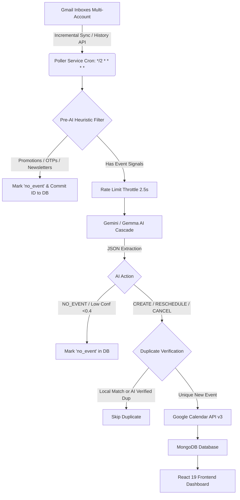

# 📘 AutoCal AI — Comprehensive System Architecture & Engineering Reference

---

## 1. Executive Summary & Core Mission
**AutoCal AI** is an autonomous background engine and management platform that monitors Gmail inboxes (multi-account supported), extracts meeting invitations, webinars, classes, and schedules using Google Generative AI (Gemini & Gemma models), and synchronizes them directly to Google Calendar while preventing duplicates, filtering spam/marketing noise, and preserving local timezones.

---

## 2. High-Level System Architecture



---

## 3. End-to-End Pipeline & Critical Subsystems

### 3.1 Gmail Ingestion & OAuth Token Lifecycle (`src/services/gmailService.js`)
* **Tokens at Rest**: AES-256 encrypted using `CryptoJS` via Mongoose `pre('save')` hooks in `GmailAccount.js`.
* **Auto-Refresh**: `OAuth2Client.on('tokens')` listener automatically captures refreshed tokens from Google and encrypts them back to MongoDB without interrupting polling loops.
* **Sync Engine**: Uses `gmail.users.history.list` with `startHistoryId`. If `historyId` expires or is missing, falls back to `getRecentMessages(account, 10)` or initializes the baseline from `getProfile()` without burning quota on 30 past emails.
* **Content Extraction**: Strips HTML tags, decodes `base64url` MIME parts, and bounds body length to 3,000 characters to prevent LLM token overflow.

### 3.2 Pre-AI Heuristic Filter (`src/services/pollerService.js:evaluatePreAiFilter`)
Saves **70–80%** of AI quota by short-circuiting:
1. **Gmail Tab Categories**: Skips `CATEGORY_PROMOTIONS`, `CATEGORY_SOCIAL`, `CATEGORY_FORUMS`.
2. **Positive Override**: If video conference URLs (`meet.google.com`, `zoom.us/j`, `teams.microsoft.com`), meeting credentials, or keywords (`interview`, `webinar`, `class schedule`) are found, it is *never* skipped.
3. **Pattern Filters**: Blocks OTPs, 2FA alerts, receipts, shipping updates, discounts, sales, and job alert digests.
4. **Known Sender Domain Blacklist**: Filters promotional senders like Swiggy, Zomato, Uber, Amazon, Flipkart, LinkedIn, LeetCode, Medium, and banking newsletters.

### 3.3 AI Parsing & Quota Resilience (`src/services/geminiService.js`)
* **Multi-Model Fallback Hierarchy**:
  ```javascript
  const FALLBACK_MODELS = [
    'gemini-3.5-flash-lite', // 15 RPM | 500 RPD
    'gemma-4-31b-it',        // 30 RPM | 1,500 RPD (burst absorber)
    'gemma-4-26b-a4b-it',    // 30 RPM | 1,500 RPD
    'gemini-3.1-flash-lite', // 15 RPM | 500 RPD
    'gemini-3.5-flash',      // 20 RPD reserve preview
    'gemini-3.6-flash',      // 20 RPD reserve preview
    'gemini-3.7-flash'       // 20 RPD reserve preview
  ];
  ```
* **Balanced Bracket JSON Parser**: Uses stateful depth counting (`{` vs `}`) ignoring quotes and escapes, isolating the exact root JSON candidate and dropping any trailing conversational commentary from Gemma models.
* **Syntax Sanitizer**: Automatically cleans ellipses (`...`), trailing commas (`, }`), and JavaScript/C-style comments before parsing.
* **Multi-Key Rotation**: Supports comma-separated API keys in `GEMINI_API_KEY` with round-robin balancing (`getNextGeminiApiKey()`).

---

## 4. Timezone Mechanics & The +5:30 Bug Fixes

### The Problem That Occurred:
1. **Google Calendar API Behavior**: If an ISO string without an explicit timezone offset is sent (`"2026-09-02T19:00:00"`), Google Calendar assumes the timestamp is in **UTC** and shifts it to your local timezone (+5:30 IST):
   $$\text{19:00 (7:00 PM UTC)} + \text{5:30 (IST)} = \mathbf{\text{00:30 (12:30 AM Next Day)}}$$
2. **Relative Date Resolution ("Tomorrow")**: If Gemini is not supplied with the current local time in India Standard Time (`Asia/Kolkata`), relative terms like "Tomorrow at 7:00 PM" were evaluated against UTC server time.

### The Solutions Deployed:
1. **Explicit Offset Construction in `calendarService.js`**:
   `formatEventTime` now appends `+05:30` directly to ISO strings for both string inputs and `Date` instances:
   ```javascript
   const localIso = `${y}-${m}-${d}T${h}:${min}:${s}+05:30`;
   return { dateTime: localIso, timeZone: targetZone };
   ```
2. **Canonical Local Dates in `pollerService.js`**:
   `eventStart` and `eventEnd` stored in MongoDB use `parseEventDates()` and `createDateInTimezone()` directly, preventing intermediate `new Date(created.start.dateTime)` conversions from introducing timezone drift.
3. **Local Reference Time in Gemini Prompts**:
   `analyzeEmail` and `analyzeThread` inject:
   ```text
   Current Local Reference Time (Asia/Kolkata): 2026-09-01 22:35
   ```
   ensuring the AI evaluates "tomorrow" or day-of-week relative terms in local Indian time.

---

## 5. Database Schema & Data Models

| Model | File | Primary Keys & Indexes | Key Fields | Purpose |
|---|---|---|---|---|
| **User** | `src/models/User.js` | `_id`, `googleId` (unique), `email` (unique) | `name`, `accounts` (ref array), `settings` (`autoAdd`, `filterSenders`, `monitorLabels`) | User identity & preferences |
| **GmailAccount** | `src/models/GmailAccount.js` | Compound Unique: `(userId, email)` | `accessToken` (AES), `refreshToken` (AES), `lastHistoryId`, `isActive`, `lastPolledAt` | Multi-inbox OAuth tokens & sync cursor |
| **Event** | `src/models/Event.js` | `_id`, `userId` | `calendarEventId`, `title`, `description`, `location`, `startTime`, `endTime`, `status`, `history` | Scheduled event with full audit trail |
| **ProcessedThread** | `src/models/ProcessedThread.js` | Compound Unique: `(accountId, gmailThreadId)` | `lastMessageId`, `messageCount`, `linkedEvent`, `status` (`active`, `cancelled`, `no_event`) | Poller idempotency & deduplication record |

---

## 6. Frontend Architecture (`frontend/src/`)

* **Framework**: React 19 + Vite 8 + React Router v7.
* **State & Health**: `AuthContext.jsx` manages user state, OAuth redirects, and auto-detects server downtime, rendering `Maintenance.jsx` with an automatic 15-second ping recovery.
* **Pages**:
  * **Dashboard** (`/`): Overview metrics, recent processed emails, upcoming events, manual scan trigger.
  * **Emails** (`/emails`): Paginated intelligence feed with thread inspection modal.
  * **Events** (`/events`): Calendar events table, status filters, manual sync button, event edit modal.
  * **Accounts** (`/accounts`): Multi-inbox Gmail linking & unlinking.

---

## 7. Operational Cheatsheet & Maintenance

### Starting the Application:
```bash
# Backend (Port 3000)
cd backend
npm run dev

# Frontend (Port 5173)
cd frontend
npm run dev
```

### Key Environment Variables (`backend/.env`):
* `PORT=3000`
* `MONGODB_URI=mongodb+srv://...`
* `GOOGLE_CLIENT_ID=...`
* `GOOGLE_CLIENT_SECRET=...`
* `GOOGLE_REDIRECT_URI=http://localhost:3000/api/auth/google/callback`
* `GEMINI_API_KEY=key1,key2,key3` (supports comma-separated rotation)
* `SESSION_SECRET=...`
* `ENCRYPTION_KEY=...` (32+ character key for AES token encryption)
* `FRONTEND_URL=http://localhost:5173`
